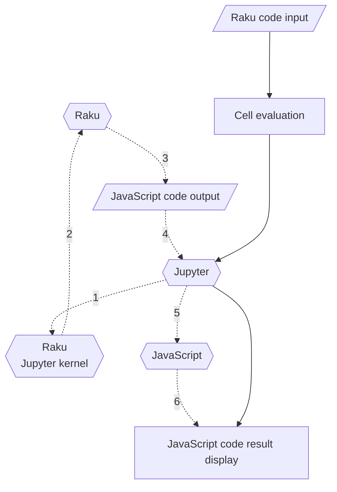

# JavaScript::D3 Raku package

This repository has the a Raku package for generation of JavaScript's D3 code for making plots and charts.

This package is intended to be used in Jupyter notebooks with the
[Raku kernel implemented by Brian Duggan](https://github.com/bduggan/raku-jupyter-kernel), [BD1].
The commands of the package generate JavaScript code that produces (nice) [D3.js](https://d3js.org/) plots or charts.

For illustrative examples see the Jupyter notebook
["Tests-for-JavaScript-D3"](https://nbviewer.org/github/antononcube/Raku-JavaScript-D3/blob/main/resources/Tests-for-JavaScript-D3.ipynb).

The (original versions of the) JavaScript snippets used in this package are taken from
["The D3.js Graph Gallery"](https://d3-graph-gallery.com/index.html).

--------

## Mission statement

Make first class -- beautiful, tunable, and useful -- plots and charts with Raku using 
concise specifications.

--------

## Design and philosophy

Here is a list of guiding design principles:

- Concise plot and charts specifications.

- Using Mathematica's plot functions for commands signatures inspiration. 
  (Instead of, say, R's ["ggplot2"](https://ggplot2.tidyverse.org).)

  - For example, see [`ListPlot`](https://reference.wolfram.com/language/ref/ListPlot.html), 
    [`BubbleChart`](https://reference.wolfram.com/language/ref/BubbleChart.html).
  
- The primary target data structure to visualize is an array of hashes, 
   with all array elements having the one of these sets of keys 
   - `<x y>` 
   - `<x y group>`
   - `<x y z>`
   - `<x y z group>` 
   
- Multiple-dataset plots are produced via dataset records that have the key "group".  

- Whenever possible deduce the keys from arrays of scalars.

- The data reshaping functions in "Data::Reshapers", [AAp1], should fit nicely into workflows with this package.

- The package functions are tested separately:

  - As Raku functions that produce output for given signatures
  - As JavaScript plots that correspond to the corresponding intents
  
--------

## How does it work?

Here is a diagram that summarizes the evaluation path from a Raku plot spec to a browser diagram:



Here is the corresponding narration:

1. Enter Raku plot command in cell that starts with 
   [the magic spec `%% js`](https://github.com/bduggan/raku-jupyter-kernel/issues/100#issuecomment-1349494169).

   - Like `js-d3-list-plot((^12)>>.rand)`.
   
2. Jupyter via the Raku kernel evaluates the Raku plot command.

3. The Raku plot command produces JavaScript code.

4. The Jupyter "lets" the web browser to evaluate the obtained JavaScript code.

   - Instead of web browser, say, Visual Studio Code can be used.

   
The evaluation loop spelled out above is possible because of the magics implementation in the Raku package
[Jupyter::Kernel](https://github.com/bduggan/raku-jupyter-kernel#features), 
[BD1].
   
--------

## Alternatives

### Raku packages

The Raku packages "Text::Plot", [AAp2], and "SVG::Plot", [MLp1],
provide similar functionalities and both can be used in Jupyter notebooks. 
(Well, "Text::Plot" can be used anywhere.)

### Different backend

Instead of using [D3.js](https://d3js.org) as a "backend" it is possible -- and instructive --
to implement Raku plotting functions that generate JavaScript code for the library 
[Chart.js](https://www.chartjs.org).

D3.js is lower level than Chart.js, hence in principle Chart.js is closer to the mission of this Raku package.
I.e. at first I considered having Raku plotting implementations with Chart.js
(in a package called "JavaScript::Chart".)
But I had hard time making Chart.js plots work consistently within Jupyter.

--------

## Command Line Interface (CLI)

The package provides a CLI script that can be used to generate HTML files with plots or charts.

```shell
js-d3-graphics --help
```
```
# Usage:
#   js-d3-graphics <cmd> [<points> ...] [-p|--point-char=<Str>] [-w|--width[=UInt]] [-h|--height[=UInt]] [-t|--title=<Str>] [--x-label=<Str>] [--y-label=<Str>] [--background=<Str>] [--color=<Str>] [--grid-lines] [--format=<Str>] -- Makes textual (terminal) plots.
#   js-d3-graphics <cmd> <words> [-w|--width[=UInt]] [-h|--height[=UInt]] [-t|--title=<Str>] [--x-label=<Str>] [--y-label=<Str>] [--background=<Str>] [--color=<Str>] [--grid-lines] [--format=<Str>] -- Makes textual (terminal) plots by splitting a string of data points.
#   js-d3-graphics <cmd> [-w|--width[=UInt]] [-h|--height[=UInt]] [-t|--title=<Str>] [--x-label=<Str>] [--y-label=<Str>] [--background=<Str>] [--color=<Str>] [--grid-lines] [--format=<Str>] -- Makes textual (terminal) plots from pipeline input
#   
#     <cmd>                    Graphics command.
#     [<points> ...]           Data points.
#     -p|--point-char=<Str>    Plot points character. [default: '*']
#     -w|--width[=UInt]        Width of the plot. (-1 for Whatever.) [default: 800]
#     -h|--height[=UInt]       Height of the plot. (-1 for Whatever.) [default: 600]
#     -t|--title=<Str>         Title of the plot. [default: '']
#     --x-label=<Str>          Label of the X-axis. If Whatever, then no label is placed. [default: '']
#     --y-label=<Str>          Label of the Y-axis. If Whatever, then no label is placed. [default: '']
#     --background=<Str>       Image background color [default: 'white']
#     --color=<Str>            Color. [default: 'steelblue']
#     --grid-lines             Should grid lines be drawn or not? [default: False]
#     --format=<Str>           Output format, one of 'jupyter' or 'html'. [default: 'html']
#     <words>                  String with data points.
```

Here is an usage example that produces a list line plot:

```
js-d3-graphics list-line-plot 1 2 2 12 33 41 15 5 -t="Nice plot" --x-label="My X" --y-label="My Y" > out.html && open out.html
```

Here is an example that produces bubble chart:

```
js-d3-graphics bubble-chart "1,1,10 2,2,12 33,41,15 5,3,30" -t="Nice plot" --x-label="My X" --y-label="My Y" > out.html && open out.htm
```

--------

## TODO

In the lists below the highest priority items are placed first.

### Plots

#### Single dataset

1. [X] DONE List plot
3. [X] DONE List line plot
5. [X] DONE Date list plot
7. [ ] TODO Box plot

#### Multiple dataset

1. [ ] TODO List plot
2. [X] TODO List line plot
3. [X] DONE Date list plot 
4. [ ] TODO Box plot 

### Charts

#### Single dataset

1. [X] DONE Bar chart
2. [X] DONE Histogram 
3. [X] DONE Bubble chart
4. [ ] TODO Density 2D chart -- rectangular bins
5. [ ] TODO Radar chart 
6. [ ] TODO Density 2D chart -- hexagonal bins
7. [ ] TODO Pie chart

#### Multiple dataset

1. [ ] TODO Bar chart
2. [ ] TODO Histogram
3. [X] DONE Bubble chart
4. [X] DONE Bubble chart with tooltips
5. [ ] TODO Pie chart 
7. [ ] TODO Radar chart

### Decorations

User specified or automatic:

1. [X] DONE Plot label / title
2. [X] DONE Axes labels
3. [X] DONE Plot margins
4. [X] DONE Plot legends (automatic for multi-datasets plots and chart)
5. [X] DONE Plot grid lines 
     - [X] DONE Automatic 
     - [X] DONE User specified number of ticks
6. [ ] TODO Title style (font size, color, face)
7. [ ] TODO Axes labels style (font size, color, face)
8. [ ] TODO Grid lines style

### Infrastructural

1. [X] DONE Support for different JavaScript wrapper styles
  
   - [X] DONE Jupyter cell execution ready
   
   - [X] DONE Standard HTML
   
   - Result output with JSON format?

2. [ ] TODO Better, comprehensive type checking
   
   - Using the type system of "Data::Reshapers", [AAp1], would be ideal, 
     but I do not want to introduce such a "heavy" dependency.

3. [X] DONE CLI script

4. [ ] TODO JavaScript code snippets management

   - If they become too many.

--------

## Implementation details

### Splicing of JavaScript snippets

The package works by splicing of parametrized JavaScript code snippets and replacing the parameters
with concrete values.

In a sense, JavaScript macros are used to construct the final code through text manipulation.
(Probably, unsound software-engineering-wise, but it works.)

### History

Initially  the commands of this package were executed in
[Jupyter notebook with Raku kernel](https://raku.land/cpan:BDUGGAN/Jupyter::Kernel)
properly
[hacked to redirect Raku code to JavaScript backend](https://github.com/bduggan/p6-jupyter-kernel/issues/100)

Brian Duggan fairly quickly implemented the suggested Jupyter kernel magics, so, now no hacking is needed.

--------

## References

### Articles

[OV1] Olivia Vane, 
["D3 JavaScript visualisation in a Python Jupyter notebook"](https://livingwithmachines.ac.uk/d3-javascript-visualisation-in-a-python-jupyter-notebook), 
(2020), 
[livingwithmachines.ac.uk](https://livingwithmachines.ac.uk).

[SF1] Stefaan Lippens, 
[Custom D3.js Visualization in a Jupyter Notebook](https://www.stefaanlippens.net/jupyter-custom-d3-visualization.html), 
(2018), 
[stefaanlippens.net](https://www.stefaanlippens.net).

### Packages

[AAp1] Anton Antonov,
[Data::Reshapers Raku package](https://raku.land/zef:antononcube/Data::Reshapers),
(2021-2022),
[GitHub/antononcube](https://github.com/antononcube/Raku-Data-Reshapers).

[AAp2] Anton Antonov,
[Text::Plot Raku package](https://raku.land/zef:antononcube/Text::Plot),
(2022),
[GitHub/antononcube](https://github.com/antononcube/Raku-Text-Plot).

[BD1] Brian Duggan,
[Jupyter::Kernel Raku package](https://raku.land/cpan:BDUGGAN/Jupyter::Kernel),
(2017-2022),
[GitHub/bduggan](https://github.com/bduggan/raku-jupyter-kernel).

[MLp1] Moritz Lenz,
[SVG::Plot Raku package](https://github.com/moritz/svg-plot)
(2009-2018),
[GitHub/moritz](https://github.com/moritz/svg-plot).
